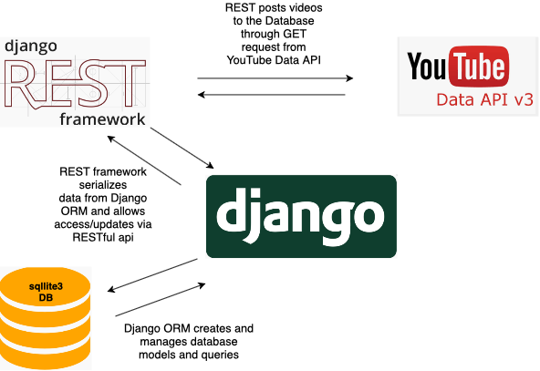

<p align="center">

</p>

A Django REST API to fetch latest videos sorted in reverse chronological order of their publishing date-time from YouTube for a given tag/search query in a paginated response.


## Architecture

<p align="center">

</p>


## Directory Structure
    
    fetch_youtube             
    .
    ├── Contains       
    |   ├── Screenshots       # Contain screenshots of the project and other images
    │   ├── api               # The main Django app/api containing the models, views, serializers etc
    │   ├── fetch_api         # All the settings and url routes settings of the REST API
    |   ├── db.sqlite3        # SQLite database housing the data of the videos fetched
    │   └── manage.py         # Python code used for starting the app by establishing DRF server
    |   └── requirements.txt  # Requirements file
    |______________________   

## Instructions for Setup

Clone the repo and install Requirements :

```bash
git clone https://github.com/saket13/fetch_youtube
cd path_to_fetch_youtube
pip3 install -r requirements.txt (Install the requirements preferrably in Virtual environment)
```

Modify settings.py File - Remove the existing keys and add your own YouTube Data API keys in the form [key1, key2, ...]:

```bash
API_KEYS = ['Google_API_Key_1', 'Google_API_Key_2','Google_API_Key_3',] 
```

## Usage

Run the manage.py file:

```python
python3 manage.py runserver
```

To fetch new videos, visit the '/new' endpoint:

```bash
open http://127.0.0.1:8000/new 
to fetch the new videos in paginated and reverse chronological format
```

For watching added videos 

```bash
open http://127.0.0.1:8000
to see all the fetched videos related to cricket query posted in the past 5 minutes.
```

## CRON JOBS Support

Configure the settings.py as per django-cron and 
write a cron class hat extends the CronJobBase class in api_test.py inside api app file and 
call the getnewposts() function inside do(self) function as prescribed by documentation and set RUN_EVERY_MINS = 'Time_Duration'


This will automatically fetch the videos after every given duration time which removes the need for hitting '\new' endpoint:


## Screenshots

**Homepage:**

<p align="center">

</p>

**Filter and Sorting Options:**

<p align="center">

</p>

**Adding New Student:**

|   |   |
|:---:|:---:|
| Database view | Single Video View |


## Future Ideas and TODOs

* To make a completely independent front-end architecture for fetching videos on the basis of query given by user instead of pre defined

* The Google API keys if shown, to be shown in encrypted format

* Front End can be made to play the embedded youtube video


## Contact
If you need any help, you can connect with me.

Visit:- [saketsaumya.info](https://saketsaumya.info)
